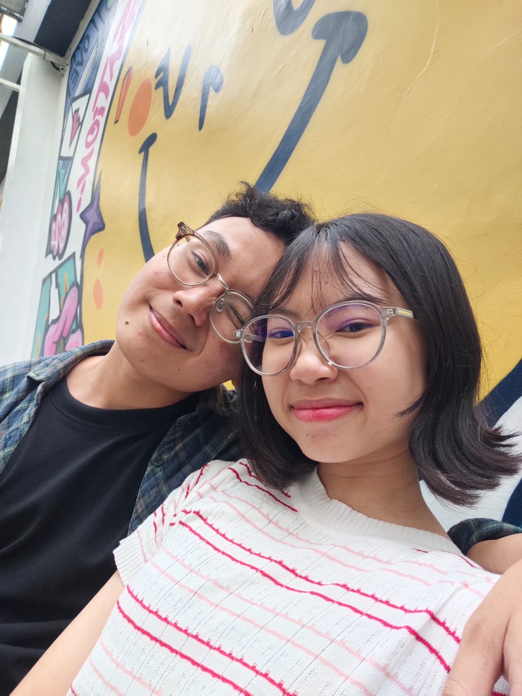

<html>
<html lang="id">
<head>
    <meta charset="UTF-8">
    <meta name="viewport" content="width=device-width, initial-scale=1.0">
    <title>Ucapan Cinta</title>
    <link rel="stylesheet" href="css love.css">
</head>
<body>
    

        <h1>Hai Ayangggg! 💌</h1>
        
Klik tombol di bawah ini sayang untuk melihat sesuatu yang spesial!

        <button onclick="tampilkanUcapan()">Klik Aku 💕</button>
        

            
✨ Aku cuma mau bilang... ✨

            <h2>🌹 Aku sayang kamu! 🌹</h2>
             
            
Terima kasih sudah hadir dalam hidupku, semoga kita bisa lewatin ini semua. 😘

        

    

    
</body>
</html>
